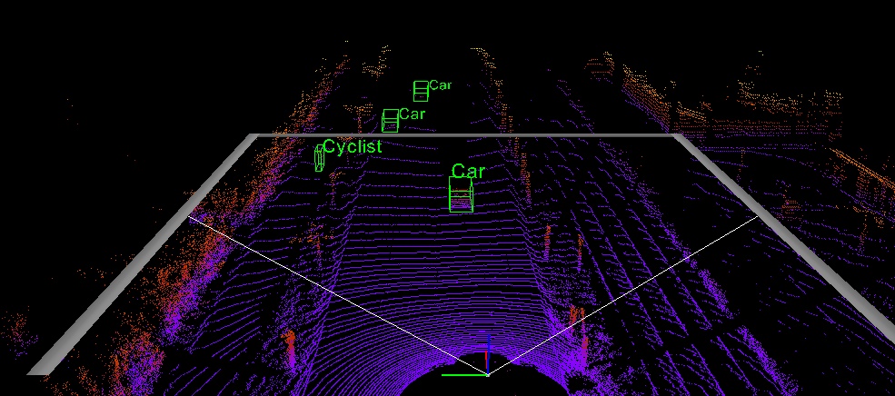

# Complex YOLOv4

[![python-image]][python-url]
[![pytorch-image]][pytorch-url]

This repository combines the PyTorch Implementation based on YOLOv4 of the paper: [Complex-YOLO: Real-time 3D Object Detection on Point Clouds](https://arxiv.org/pdf/1803.06199.pdf) by [maudzung](https://github.com/maudzung/Complex-YOLOv4-Pytorch) and the [visualization of the Images and 3D point clouds with ground truth from the kitti dataset](https://github.com/kuixu/kitti_object_vis)

[](http://www.youtube.com/watch?v=FI8mJIXkgX4)

## 1. Getting Started
### 1.1. Setup environment

- Start from a new conda environment:
```
conda create -n complexYOLOv4 python=3.7 # vtk does not support python 3.8
conda activate complexYOLOv4
```
- Install the requirements
```
pip3 install -U -r requirements.txt
```
- install mayavi from conda-forge, this installs vtk and pyqt5 automatically
```
conda install mayavi -c conda-forge
```

For [`mayavi`](https://docs.enthought.com/mayavi/mayavi/installation.html) and [`shapely`](https://shapely.readthedocs.io/en/latest/project.html#installing-shapely) 
libraries, you may have to refer to the installation instructions from their official websites.

### 1.2. Data Preparation
Download the 3D KITTI detection dataset from [here](http://www.cvlibs.net/datasets/kitti/eval_object.php?obj_benchmark=3d).

The downloaded data includes:

- Velodyne point clouds _**(29 GB)**_: input data to the Complex-YOLO model
- Training labels of object data set _**(5 MB)**_: input label to the Complex-YOLO model
- Camera calibration matrices of object data set _**(16 MB)**_: for visualization of predictions
- Left color images of object data set _**(12 GB)**_: for visualization of predictions

Please make sure that you construct the source code & dataset directories structure as below.

For 3D point cloud preprocessing, please refer to the previous works:
- [VoxelNet-Pytorch](https://github.com/skyhehe123/VoxelNet-pytorch)
- [Complex-YOLOv2](https://github.com/AI-liu/Complex-YOLO)
- [Complex-YOLOv3](https://github.com/ghimiredhikura/Complex-YOLOv3)


### 1.3. Complex-YOLO architecture


This work has been based on the paper [YOLOv4: Optimal Speed and Accuracy of Object Detection](https://arxiv.org/abs/2004.10934).

Please refer to several implementations of YOLOv4 using PyTorch DL framework:
- [Tianxiaomo/pytorch-YOLOv4](https://github.com/Tianxiaomo/pytorch-YOLOv4)
- [Ultralytics/yolov3_and_v4](https://github.com/ultralytics/yolov3)
- [WongKinYiu/PyTorch_YOLOv4](https://github.com/WongKinYiu/PyTorch_YOLOv4)
- [VCasecnikovs/Yet-Another-YOLOv4-Pytorch](https://github.com/VCasecnikovs/Yet-Another-YOLOv4-Pytorch)

## 2. How to run

### 2.1. Visualize dataset (BEV images from LiDAR and camera images)

```shell script
cd src/data_process
```

- To visualize BEV maps and camera images (with 3D boxes), let's execute _**(the `output-width` param can be changed to 
show the images in a bigger/smaller window)**_:

```shell script
python kitti_dataloader.py --output-width 608
```

- To visualize mosaics that are composed from 4 BEV maps (Using during training only), let's execute:

```shell script
python kitti_dataloader.py --show-train-data --mosaic --output-width 608 
```

By default, there is _**no padding**_ for the output mosaics, the feature could be activated by executing:

```shell script
python kitti_dataloader.py --show-train-data --mosaic --random-padding --output-width 608 
```

- To visualize cutout augmentation, let's execute:

```shell script
python kitti_dataloader.py --show-train-data --cutout_prob 1. --cutout_nholes 1 --cutout_fill_value 1. --cutout_ratio 0.3 --output-width 608
```

### 2.2. Visualize dataset (3D point clouds from LiDAR and camera images)

1. 3D boxes on LiDar point cloud in volumetric mode
2. 2D and 3D boxes on Camera image
3. 2D boxes on LiDar Birdview
4. LiDar data on Camera image


```shell
$ python3 kitti_object.py --help
usage: kitti_object.py [-h] [-d N] [-i N] [-p] [-s] [-l N] [-e N] [-r N]
                       [--gen_depth] [--vis] [--depth] [--img_fov]
                       [--const_box] [--save_depth] [--pc_label]
                       [--show_lidar_on_image] [--show_lidar_with_depth]
                       [--show_image_with_boxes]
                       [--show_lidar_topview_with_boxes]

KIITI Object Visualization

optional arguments:
  -h, --help            show this help message and exit
  -d N, --dir N         input (default: data/object)
  -i N, --ind N         input (default: data/object)
  -p, --pred            show predict results
  -s, --stat            stat the w/h/l of point cloud in gt bbox
  -l N, --lidar N       velodyne dir (default: velodyne)
  -e N, --depthdir N    depth dir (default: depth)
  -r N, --preddir N     predicted boxes (default: pred)
  --gen_depth           generate depth
  --vis                 show images
  --depth               load depth
  --img_fov             front view mapping
  --const_box           constraint box
  --save_depth          save depth into file
  --pc_label            5-verctor lidar, pc with label
  --show_lidar_on_image
                        project lidar on image
  --show_lidar_with_depth
                        --show_lidar, depth is supported
  --show_image_with_boxes
                        show lidar
  --show_lidar_topview_with_boxes
                        show lidar topview
  --split               use training split or testing split (default: training)

```
Change to the viz directory:
```
cd viz
```
Replace `<PATH>` with your path to the dataset dir and display LiDAR and image with specific index: 
```
python3 kitti_object.py -d <PATH>/dataset/kitti --show_lidar_with_depth --const_box --vis --show_image_with_boxes --ind 1
```

#### 2.2.1. Demo of visualization

#### 2D, 3D boxes and LiDar data on Camera image


Credit: @yuanzhenxun

#### LiDar birdview and point cloud (3D)


#### 2.2.2. Show Predicted Results

Firstly, map KITTI official formated results into data directory
```
./map_pred.sh /path/to/results
```

```python
python kitti_object.py -p --vis
```


### 2.3. Inference

Download the trained model from [**_here_**](https://drive.google.com/drive/folders/1RHD9PBvk-9SjbKwoi_Q1kl9-UGFo2Pth?usp=sharing), 
then put it to `${ROOT}/checkpoints/` and execute:

```shell script
python test.py --gpu_idx 0 --pretrained_path ../checkpoints/complex_yolov4/complex_yolov4_mse_loss.pth --cfgfile ./config/cfg/complex_yolov4.cfg --show_image
```

### 2.4. Evaluation

```shell script
python evaluate.py --gpu_idx 0 --pretrained_path <PATH> --cfgfile <CFG> --img_size <SIZE> --conf-thresh <THRESH> --nms-thresh <THRESH> --iou-thresh <THRESH>
```
(The `conf-thresh`, `nms-thresh`, and `iou-thresh` params can be adjusted. By default, these params have been set to _**0.5**_)

### 2.5. Training

#### 2.5.1. Single machine, single gpu

```shell script
python train.py --gpu_idx 0 --batch_size <N> --num_workers <N>...
```

#### 2.5.2. Multi-processing Distributed Data Parallel Training
We should always use the `nccl` backend for multi-processing distributed training since it currently provides the best 
distributed training performance.

- **Single machine (node), multiple GPUs**

```shell script
python train.py --dist-url 'tcp://127.0.0.1:29500' --dist-backend 'nccl' --multiprocessing-distributed --world-size 1 --rank 0
```

- **Two machines (two nodes), multiple GPUs**

_**First machine**_

```shell script
python train.py --dist-url 'tcp://IP_OF_NODE1:FREEPORT' --dist-backend 'nccl' --multiprocessing-distributed --world-size 2 --rank 0
```
_**Second machine**_

```shell script
python train.py --dist-url 'tcp://IP_OF_NODE2:FREEPORT' --dist-backend 'nccl' --multiprocessing-distributed --world-size 2 --rank 1
```

To reproduce the results, you can run the bash shell script

```bash
./train.sh
```

### Tensorboard

- To track the training progress, go to the `logs/` folder and 

```shell script
cd logs/<saved_fn>/tensorboard/
tensorboard --logdir=./
```

- Then go to [http://localhost:6006/](http://localhost:6006/):


### 2.6. List of usage for Bag of Freebies (BoF) & Bag of Specials (BoS) in this implementation


|   |Backbone   | Detector   |
|---|---|---|
|**BoF**   |[x] Dropblock <br> [x] Random rescale, rotation (global) <br> [x] Mosaic/Cutout augmentation|[x] Cross mini-Batch Normalization <br>[x] Dropblock <br> [x] Random training shapes <br>   |
|**BoS**   |[x] Mish activation <br> [x] Cross-stage partial connections (CSP) <br> [x] Multi-input weighted residual connections (MiWRC)   |[x] Mish activation <br> [x] SPP-block <br> [x] SAM-block <br> [x] PAN path-aggregation block <br> [x] GIoU loss <br> [ ] CIoU loss |


## Contact

If you think this work is useful, please give me a star! <br>
If you find any errors or have any suggestions, please contact me (**Email:** `nguyenmaudung93.kstn@gmail.com`). <br>
Thank you!


## Citation

```bash
@article{Complex-YOLO,
  author = {Martin Simon, Stefan Milz, Karl Amende, Horst-Michael Gross},
  title = {Complex-YOLO: Real-time 3D Object Detection on Point Clouds},
  year = {2018},
  journal = {arXiv},
}

@article{YOLOv4,
  author = {Alexey Bochkovskiy, Chien-Yao Wang, Hong-Yuan Mark Liao},
  title = {YOLOv4: Optimal Speed and Accuracy of Object Detection},
  year = {2020},
  journal = {arXiv},
}
```
## Acknowlegement

Code is mainly from [f-pointnet](https://github.com/charlesq34/frustum-pointnets) and [MV3D](https://github.com/bostondiditeam/MV3D)

## Folder structure

```
${ROOT}
└── checkpoints/    
    ├── complex_yolov3/
    └── complex_yolov4/
└── dataset/    
    └── kitti/
        ├──ImageSets/
        │   ├── train.txt
        │   └── val.txt
        ├── training/
        │   ├── image_2/ <-- for visualization
        │   ├── calib/
        │   ├── label_2/
        │   └── velodyne/
        └── testing/  
        │   ├── image_2/ <-- for visualization
        │   ├── calib/
        │   └── velodyne/ 
        └── classes_names.txt
└── src/
    ├── config/
    ├── cfg/
        │   ├── complex_yolov3.cfg
        │   ├── complex_yolov3_tiny.cfg
        │   ├── complex_yolov4.cfg
        │   ├── complex_yolov4_tiny.cfg
    │   ├── train_config.py
    │   └── kitti_config.py
    ├── data_process/
    │   ├── kitti_bev_utils.py
    │   ├── kitti_dataloader.py
    │   ├── kitti_dataset.py
    │   ├── kitti_data_utils.py
    │   ├── train_val_split.py
    │   └── transformation.py
    ├── models/
    │   ├── darknet2pytorch.py
    │   ├── darknet_utils.py
    │   ├── model_utils.py
    │   ├── yolo_layer.py
    └── utils/
    │   ├── evaluation_utils.py
    │   ├── iou_utils.py
    │   ├── logger.py
    │   ├── misc.py
    │   ├── torch_utils.py
    │   ├── train_utils.py
    │   └── visualization_utils.py
    ├── evaluate.py
    ├── test.py
    ├── test.sh
    ├── train.py
    └── train.sh
├── README.md 
└── requirements.txt
```

## Usage

```
usage: train.py [-h] [--seed SEED] [--saved_fn FN] [--working-dir PATH]
                [-a ARCH] [--cfgfile PATH] [--pretrained_path PATH]
                [--img_size IMG_SIZE] [--hflip_prob HFLIP_PROB]
                [--cutout_prob CUTOUT_PROB] [--cutout_nholes CUTOUT_NHOLES]
                [--cutout_ratio CUTOUT_RATIO]
                [--cutout_fill_value CUTOUT_FILL_VALUE]
                [--multiscale_training] [--mosaic] [--random-padding]
                [--no-val] [--num_samples NUM_SAMPLES]
                [--num_workers NUM_WORKERS] [--batch_size BATCH_SIZE]
                [--print_freq N] [--tensorboard_freq N] [--checkpoint_freq N]
                [--start_epoch N] [--num_epochs N] [--lr_type LR_TYPE]
                [--lr LR] [--minimum_lr MIN_LR] [--momentum M] [-wd WD]
                [--optimizer_type OPTIMIZER] [--burn_in N]
                [--steps [STEPS [STEPS ...]]] [--world-size N] [--rank N]
                [--dist-url DIST_URL] [--dist-backend DIST_BACKEND]
                [--gpu_idx GPU_IDX] [--no_cuda]
                [--multiprocessing-distributed] [--evaluate]
                [--resume_path PATH] [--conf-thresh CONF_THRESH]
                [--nms-thresh NMS_THRESH] [--iou-thresh IOU_THRESH]

The Implementation of Complex YOLOv4

optional arguments:
  -h, --help            show this help message and exit
  --seed SEED           re-produce the results with seed random
  --saved_fn FN         The name using for saving logs, models,...
  --working-dir PATH    The ROOT working directory
  -a ARCH, --arch ARCH  The name of the model architecture
  --cfgfile PATH        The path for cfgfile (only for darknet)
  --pretrained_path PATH
                        the path of the pretrained checkpoint
  --img_size IMG_SIZE   the size of input image
  --hflip_prob HFLIP_PROB
                        The probability of horizontal flip
  --cutout_prob CUTOUT_PROB
                        The probability of cutout augmentation
  --cutout_nholes CUTOUT_NHOLES
                        The number of cutout area
  --cutout_ratio CUTOUT_RATIO
                        The max ratio of the cutout area
  --cutout_fill_value CUTOUT_FILL_VALUE
                        The fill value in the cut out area, default 0. (black)
  --multiscale_training
                        If true, use scaling data for training
  --mosaic              If true, compose training samples as mosaics
  --random-padding      If true, random padding if using mosaic augmentation
  --no-val              If true, dont evaluate the model on the val set
  --num_samples NUM_SAMPLES
                        Take a subset of the dataset to run and debug
  --num_workers NUM_WORKERS
                        Number of threads for loading data
  --batch_size BATCH_SIZE
                        mini-batch size (default: 4), this is the totalbatch
                        size of all GPUs on the current node when usingData
                        Parallel or Distributed Data Parallel
  --print_freq N        print frequency (default: 50)
  --tensorboard_freq N  frequency of saving tensorboard (default: 20)
  --checkpoint_freq N   frequency of saving checkpoints (default: 2)
  --start_epoch N       the starting epoch
  --num_epochs N        number of total epochs to run
  --lr_type LR_TYPE     the type of learning rate scheduler (cosin or
                        multi_step)
  --lr LR               initial learning rate
  --minimum_lr MIN_LR   minimum learning rate during training
  --momentum M          momentum
  -wd WD, --weight_decay WD
                        weight decay (default: 1e-6)
  --optimizer_type OPTIMIZER
                        the type of optimizer, it can be sgd or adam
  --burn_in N           number of burn in step
  --steps [STEPS [STEPS ...]]
                        number of burn in step
  --world-size N        number of nodes for distributed training
  --rank N              node rank for distributed training
  --dist-url DIST_URL   url used to set up distributed training
  --dist-backend DIST_BACKEND
                        distributed backend
  --gpu_idx GPU_IDX     GPU index to use.
  --no_cuda             If true, cuda is not used.
  --multiprocessing-distributed
                        Use multi-processing distributed training to launch N
                        processes per node, which has N GPUs. This is the
                        fastest way to use PyTorch for either single node or
                        multi node data parallel training
  --evaluate            only evaluate the model, not training
  --resume_path PATH    the path of the resumed checkpoint
  --conf-thresh CONF_THRESH
                        for evaluation - the threshold for class conf
  --nms-thresh NMS_THRESH
                        for evaluation - the threshold for nms
  --iou-thresh IOU_THRESH
                        for evaluation - the threshold for IoU
```

[python-image]: https://img.shields.io/badge/Python-3.6-ff69b4.svg
[python-url]: https://www.python.org/
[pytorch-image]: https://img.shields.io/badge/PyTorch-1.5-2BAF2B.svg
[pytorch-url]: https://pytorch.org/
